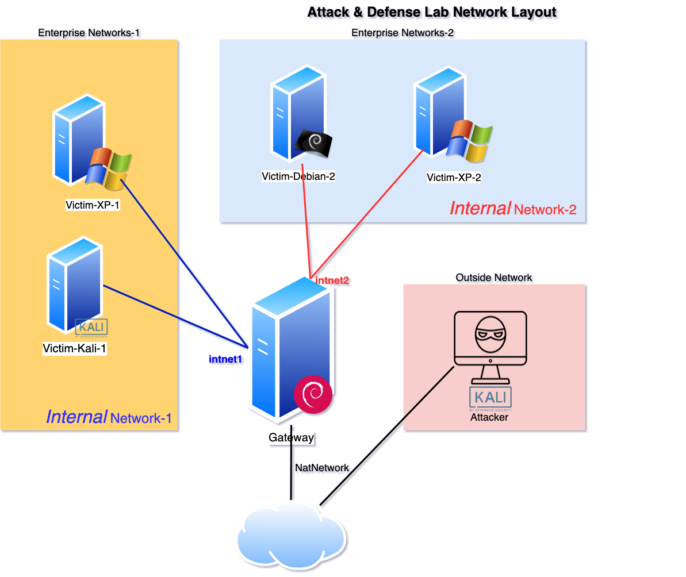

# 基于VirtualBox的网络攻防基础环境搭建

## 实验目的
- 掌握 VirtualBox 虚拟机的安装与使用；
- 掌握 VirtualBox 的虚拟网络类型和按需配置；
- 掌握 VirtualBox 的虚拟硬盘多重加载；

## 要求
- 连通性：
  

- 完成以下网络连通性测试：  
[√] 靶机可以直接访问攻击者主机  
[√] 攻击者主机无法直接访问靶机  
[√] 网关可以直接访问攻击者主机和靶机  
[√] 靶机的所有对外上下行流量必须经过网关  
[√] 所有节点均可以访问互联网  

- 虚拟机定义  
  靶机：victim-xp-1 victim-kali-1 victim-debian-2 victim-xp-2    
  网关：gateway-debian  
  攻击者：attacker-kali

# 结果性证明
- victim-xp-1 IP: 172.16.111.108
- victim-kali-1 IP: 172.16.111.133
- victim-xp-2 IP: 172.16.222.148
- victim-debian-2 IP: 172.16.222.147
- attacker-kali: 10.0.2.15
- gateway-debian:   
  enp0s3 10.0.2.4  
  enp0s8 192.168.56.101  
  enp0s9 172.16.111.1  
  enp0s10 172.16.222.1

- victim-xp-1访问attacker-kali

- victim-kali-1访问attacker-kali

- victim-xp-2访问attacker-kali

- victim-debian-2访问attacker-kali

- attacker access victims failed

- gateway-debian access attacker-kali

- gateway-debian access victims
  

- 所有节点访问互联网

- victims所有流量通过gateway-debian

## 实验过程

* 从kali.org官网上下载 [kali linux virtualbix image](https://www.offensive-security.com/kali-linux-vm-vmware-virtualbox-image-download/#1572305786534-030ce714-cc3b);
  
* 从[itellyou](https://msdn.itellyou.cn/)上下载Windows XP;
  
* 从[Debian官网链接](https://www.debian.org/CD/)上下载debian-10.5.0-amd64;
  
* 安装Attacker:   
 双击下载好的kali-linux-2020.3-vbox-amd64.ova，安装Attacker的kali虚拟机，账号密码均为kali；VirtualBox管理器里 工具->介质->选择kali的.vdi->类型改为多重加载；

* 安装Victim-Kali-1:   
选中Attacker->新建->Victim-Kali-1 linux debian->使用已有的虚拟硬盘文件->选择.vdi;

* 按照安装两个kali的以上两步，安装两个XP，两个Debian： 
   
* 配置gateway-debian的网卡：VirtualBox管理器->gateway-debian选中->设置->网络，一共配置4块网卡

* `ip a`查看gateway-debian的网络设置，查看其enp0s3的IP地址; 打开putty，用这个IP连接gateway-debian，方便使用

* 配置gateway-debian的另外两个网卡enp0s9和enp0s10，即intnet1和intnet2；利用[老师提供的配置文件](https://gist.github.com/c4pr1c3/8d1a4550aa550fabcbfb33fad9718db1)，配置/etc/network/interfaces

* `su`进入root, `apt-get update && apt-get install dnsmasq`安装dnsmasq
* 利用[老师提供的配置文件](https://gist.github.com/c4pr1c3/8d1a4550aa550fabcbfb33fad9718db1)修改dnsmasq的配置文件，配置/etc/dnsmasq.d/gw-enp010.conf和/etc/dnsmasq.d/gw-enp09.conf

- `cp dnsmasq.conf dnsmasq.conf.original`备份主配置文件/etc/dnsmasq.conf，并利用[老师提供的配置文件](https://gist.github.com/c4pr1c3/8d1a4550aa550fabcbfb33fad9718db1)修改dnsmasq的主配置文件
- `systemctl restart dnsmasq` `ps aux | grep dns`重启dnsmasq
- 关掉两个xp的防火墙
- 测试所有节点是否满足要求中的连通性

## 遇到的问题

- debian中文菱形乱码  
 [Debian中文->英文](https://blog.csdn.net/u013699869/article/details/52614400)
- Debian `apt-get update`失败，安装软件失败，出现`package has no installation candidate`或 `unable to locate package updates`:  
  [debian 无法使用apt-get解决办法](https://blog.csdn.net/jiaqi_327/article/details/21610397)
- putty连接gateway-debian失败，没有在Debian上开启ssh服务
- debian 系统安装失败，由于没有正确设置GRUB的安装位置，正确的位置应为/dev/sda

## 重要参考
[第一章 网络安全基础 p12](https://www.bilibili.com/video/BV16t4y1i7rz?p=12)