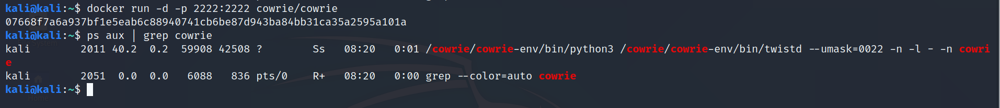

# 第十一章 蜜罐

## 实验要求
- 从[awesome-honeypots](https://github.com/paralax/awesome-honeypots)选择 
1 种低交互蜜罐和 1 种中等交互蜜罐进行搭建实验（推荐 SSH 蜜罐）
- 记录蜜罐的详细搭建过程；
- 使用 nmap 扫描搭建好的蜜罐并分析扫描结果，同时分析「 nmap 扫描期间」蜜罐上记录得到的信息；
- 如何辨别当前目标是一个「蜜罐」？以自己搭建的蜜罐为例进行说明

## 选择的两种蜜罐
#### ssh-honeypot
> 由于victim-kali上不了网，重新配置了该kali的配置文件etc/network/interfaces，
> 通过gateway连网成功
```
auto eth0
iface eth0 inet static
address 172.16.111.106
gateway 172.16.111.1
netmask 255.255.255.0
```
> git clone ssh-honeypot仓库
```
kali@kali:~$ git clone https://github.com/droberson/ssh-honeypot.git
Cloning into 'ssh-honeypot'...
remote: Enumerating objects: 18, done.
remote: Counting objects: 100% (18/18), done.
remote: Compressing objects: 100% (15/15), done.
remote: Total 336 (delta 4), reused 10 (delta 3), pack-reused 318
Receiving objects: 100% (336/336), 62.11 KiB | 25.00 KiB/s, done.
Resolving deltas: 100% (149/149), done.
kali@kali:~$ ls
Desktop  Documents  Downloads  Music  Pictures  Public  ssh-honeypot  Templates  Videos
kali@kali:~$ cd ssh-honeypot/
kali@kali:~/ssh-honeypot$ ls
bin           docker      LICENSE.md  MakefileOSX  scripts  ssh-honeypot.service
CHANGELOG.md  INSTALL.md  Makefile    README.md    src      TODO.md

```
> 根据提供的README.md搭建蜜罐
```
kali@kali:~$ sudo apt update
kali@kali:~$ sudo apt install libssh-dev libjson-c-dev
kali@kali:~/ssh-honeypot$  make
clang -Wall -static-libgcc -o bin/ssh-honeypot src/ssh-honeypot.c -lssh -ljson-c
kali@kali:~/ssh-honeypot$ ssh-keygen -t rsa -f ./ssh-honeypot.rsa
kali@kali:~/ssh-honeypot$ bin/ssh-honeypot -r ./ssh-honeypot.rsa
kali@kali:~/ssh-honeypot$ bin/ssh-honeypot -h
ssh-honeypot 0.1.0 by Daniel Roberson

usage: bin/ssh-honeypot [-?h -p <port> -a <address> -b <index> -l <file> -r <file> -f <file> -u <user>]
        -?/-h           -- this help menu
        -p <port>       -- listen port
        -a <address>    -- IP address to bind to
        -d              -- Daemonize process
        -f              -- PID file
        -L              -- toggle logging to a file. Default: on
        -l <file>       -- log file
        -s              -- toggle syslog usage. Default: off
        -r <file>       -- specify RSA key to use
        -f <file>       -- specify location to PID file
        -b              -- list available banners
        -b <string>     -- specify banner string (max 255 characters)
        -i <index>      -- specify banner index
        -u <user>       -- user to setuid() to after bind()
        -j <file>       -- path to JSON logfile
        -J <address>    -- server to send JSON logs
        -P <port>       -- port to send JSON logs
        -v      -- verbose log output
kali@kali:~/ssh-honeypot$ bin/ssh-honeypot -f
bin/ssh-honeypot: option requires an argument -- 'f'
ssh-honeypot 0.1.0 by Daniel Roberson

usage: bin/ssh-honeypot [-?h -p <port> -a <address> -b <index> -l <file> -r <file> -f <file> -u <user>]
        -?/-h           -- this help menu
        -p <port>       -- listen port
        -a <address>    -- IP address to bind to
        -d              -- Daemonize process
        -f              -- PID file
        -L              -- toggle logging to a file. Default: on
        -l <file>       -- log file
        -s              -- toggle syslog usage. Default: off
        -r <file>       -- specify RSA key to use
        -f <file>       -- specify location to PID file
        -b              -- list available banners
        -b <string>     -- specify banner string (max 255 characters)
        -i <index>      -- specify banner index
        -u <user>       -- user to setuid() to after bind()
        -j <file>       -- path to JSON logfile
        -J <address>    -- server to send JSON logs
        -P <port>       -- port to send JSON logs
        -v      -- verbose log output
```
>  install ssh-honeypot as a Systemd service so that it automatically runs at system startup:
```
kali@kali:~/ssh-honeypot$ sudo make install
kali@kali:~/ssh-honeypot$ sudo systemctl enable --now ssh-honeypot
Created symlink /etc/systemd/system/multi-user.target.wants/ssh-honeypot.service → /etc/ssh-honeypot/ssh-honeypot.service.
```


> nmap scan
```
# 扫描 tcp服务
nmap 172.16.111.106
# nmap综合扫描，包括系统探测，版本探测，脚本扫描，路由跟踪
nmap -A -Pn -p22 172.16.111.106
nmap -sT -PE 22 -T4 -n -vv 172.16.111.106//Tcp connect 
nmap -sS -PE 22 -T4 -n -vv 172.16.111.106//TCP stealth scan
nmap -sX -PE 22 -T4 -n -vv 172.16.111.106//XMAS scan
nmap -sF -PE 22 -T4 -n -vv 172.16.111.106//FIN scan
nmap -sN -PE 22 -T4 -n -vv 172.16.111.106//NULL scan
```
```
# attacker-kali的扫描结果
# 可以从扫描结果看出：22/tcp   filtered  ssh
kali@kali:~$ nmap 172.16.111.106
Starting Nmap 7.80 ( https://nmap.org ) at 2020-12-10 07:54 EST
Note: Host seems down. If it is really up, but blocking our ping probes, try -Pn
Nmap done: 1 IP address (0 hosts up) scanned in 3.06 seconds
kali@kali:~$ sudo nmap -A -Pn -p22 172.16.111.106
Starting Nmap 7.80 ( https://nmap.org ) at 2020-12-10 07:56 EST
Nmap scan report for bogon (172.16.111.106)
Host is up.

PORT   STATE    SERVICE VERSION
22/tcp filtered ssh
Too many fingerprints match this host to give specific OS details

TRACEROUTE (using proto 1/icmp)
HOP RTT     ADDRESS
1   0.92 ms bogon (172.16.222.1)
2   ... 30

OS and Service detection performed. Please report any incorrect results at https://nmap.org/submit/ .
Nmap done: 1 IP address (1 host up) scanned in 22.30 seconds
kali@kali:~$ sudo nmap -sT -PE 22 -T4 -n -vv 172.16.111.106
Starting Nmap 7.80 ( https://nmap.org ) at 2020-12-10 07:57 EST
Initiating Ping Scan at 07:57
Scanning 2 hosts [1 port/host]
Completed Ping Scan at 07:57, 1.04s elapsed (2 total hosts)
Nmap scan report for 22 (0.0.0.22) [host down, received no-response]
Nmap scan report for 172.16.111.106 [host down, received no-response]
Read data files from: /usr/bin/../share/nmap
Nmap done: 2 IP addresses (0 hosts up) scanned in 1.14 seconds
           Raw packets sent: 4 (112B) | Rcvd: 0 (0B)
kali@kali:~$ sudo nmap -sS -PE 22 -T4 -n -vv 172.16.111.106
Starting Nmap 7.80 ( https://nmap.org ) at 2020-12-10 07:57 EST
Initiating Ping Scan at 07:57
Scanning 2 hosts [1 port/host]
Completed Ping Scan at 07:57, 1.05s elapsed (2 total hosts)
Nmap scan report for 22 (0.0.0.22) [host down, received no-response]
Nmap scan report for 172.16.111.106 [host down, received no-response]
Read data files from: /usr/bin/../share/nmap
Nmap done: 2 IP addresses (0 hosts up) scanned in 1.15 seconds
           Raw packets sent: 4 (112B) | Rcvd: 0 (0B)
kali@kali:~$ sudo nmap -sX -PE 22 -T4 -n -vv 172.16.111.106
Starting Nmap 7.80 ( https://nmap.org ) at 2020-12-10 07:58 EST
Initiating Ping Scan at 07:58
Scanning 2 hosts [1 port/host]
Completed Ping Scan at 07:58, 1.04s elapsed (2 total hosts)
Nmap scan report for 22 (0.0.0.22) [host down, received no-response]
Nmap scan report for 172.16.111.106 [host down, received no-response]
Read data files from: /usr/bin/../share/nmap
Nmap done: 2 IP addresses (0 hosts up) scanned in 1.14 seconds
           Raw packets sent: 4 (112B) | Rcvd: 0 (0B)
kali@kali:~$ sudo nmap -sF -PE 22 -T4 -n -vv 172.16.111.106
Starting Nmap 7.80 ( https://nmap.org ) at 2020-12-10 07:58 EST
Initiating Ping Scan at 07:58
Scanning 2 hosts [1 port/host]
Completed Ping Scan at 07:58, 1.04s elapsed (2 total hosts)
Nmap scan report for 22 (0.0.0.22) [host down, received no-response]
Nmap scan report for 172.16.111.106 [host down, received no-response]
Read data files from: /usr/bin/../share/nmap
Nmap done: 2 IP addresses (0 hosts up) scanned in 1.13 seconds
           Raw packets sent: 4 (112B) | Rcvd: 0 (0B)
kali@kali:~$ sudo nmap -sN -PE 22 -T4 -n -vv 172.16.111.106
Starting Nmap 7.80 ( https://nmap.org ) at 2020-12-10 07:58 EST
Initiating Ping Scan at 07:58
Scanning 2 hosts [1 port/host]
Completed Ping Scan at 07:58, 1.05s elapsed (2 total hosts)
Nmap scan report for 22 (0.0.0.22) [host down, received no-response]
Nmap scan report for 172.16.111.106 [host down, received no-response]
Read data files from: /usr/bin/../share/nmap
Nmap done: 2 IP addresses (0 hosts up) scanned in 1.15 seconds
           Raw packets sent: 4 (112B) | Rcvd: 0 (0B)

# victim-kali上的日志，从结果上看一个叫ssh_bind_listen()的函数出现了问题
# 这个函数应该是跟端口监听有关，重启了ssh-honeypot服务依旧出错，至今不知道怎么修复这个错误
kali@kali:~/ssh-honeypot$ cat ssh-honeypot.log
[Sun Dec  6 08:16:40 2020] ssh-honeypot 0.1.0 by Daniel Roberson started on port 22. PID 1873
[Sun Dec  6 08:16:40 2020] FATAL: ssh_bind_listen(): 
```

> 辨别蜜罐
- 可检测到22端口的开放，但并不能进行三次握手连接，出现错误


#### cowrie


## 实验过程
[cowrie shell install](https://cowrie.readthedocs.io/en/latest/INSTALL.html)

#### 搭建
```
kali@kali:~$ docker pull cowrie/cowrie
Using default tag: latest
latest: Pulling from cowrie/cowrie
852e50cd189d: Already exists 
3ceacfb503f7: Pull complete 
0bae6ffa8fcd: Pull complete 
d2c88931209a: Pull complete 
8a61837414bd: Pull complete 
48c9886d7b95: Pull complete 
Digest: sha256:5484f108b05c3af202aa633446b6f9e85600ee44da6f09ac7906c4063fc61db4
Status: Downloaded newer image for cowrie/cowrie:latest
docker.io/cowrie/cowrie:latest
kali@kali:~$ docker run -d -p 2222:2222 cowrie/cowrie

Join the Cowrie community at: https://www.cowrie.org/slack/

Using default Python virtual environment "..//cowrie/cowrie-env"
Starting cowrie: [twistd  --umask=0022 -n -l - cowrie -n]...
2020-12-11T02:57:13+0000 [-] Python Version 3.7.3 (default, Jul 25 2020, 13:03:44) [GCC 8.3.0]
2020-12-11T02:57:13+0000 [-] Twisted Version 20.3.0
2020-12-11T02:57:13+0000 [-] Cowrie Version 2.2.0
2020-12-11T02:57:13+0000 [-] Loaded output engine: jsonlog
2020-12-11T02:57:13+0000 [twisted.scripts._twistd_unix.UnixAppLogger#info] twistd 20.3.0 (/cowrie/cowrie-env/bin/python3 3.7.3) starting up.
2020-12-11T02:57:13+0000 [twisted.scripts._twistd_unix.UnixAppLogger#info] reactor class: twisted.internet.epollreactor.EPollReactor.
2020-12-11T02:57:13+0000 [-] CowrieSSHFactory starting on 2222
2020-12-11T02:57:13+0000 [cowrie.ssh.factory.CowrieSSHFactory#info] Starting factory <cowrie.ssh.factory.CowrieSSHFactory object at 0x7f3becc60a20>
2020-12-11T02:57:13+0000 [-] Generating new RSA keypair...
2020-12-11T02:57:13+0000 [-] Generating new DSA keypair...
2020-12-11T02:57:13+0000 [-] Ready to accept SSH connections
kali@kali:~$ ps aux | grep cowrie
kali        3345  0.0  0.2  59912 42640 ?        Ss   01:48   0:02 /cowrie/cowrie-env/bin/python3 /cowrie/cowrie-env/bin/twistd --umask=0022 -n -l - -n cowrie
kali        3832  0.0  0.0   6220   956 pts/0    S+   03:12   0:00 grep --color=auto cowrie
```



```
# 已经运行了cowrie了查看<docker name>
kali@kali:~$ docker ps
CONTAINER ID        IMAGE               COMMAND             CREATED             STATUS              PORTS                              NAMES
b85974e9c2a5        cowrie/cowrie       "cowrie start -n"   5 hours ago         Up 5 hours          0.0.0.0:2222->2222/tcp, 2223/tcp   vigorous_hofstadter
# 攻击者连接靶机
docker exec -it vigorous_hofstadter tail -F /cowrie/cowrie-git/var/log/cowrie/cowrie.json
# 查看日志文件- log/debug output
var/log/cowrie/cowrie.log 
```


#### nmap扫描
```
# 扫描 tcp服务
nmap 172.16.222.106
# nmap综合扫描，包括系统探测，版本探测，脚本扫描，路由跟踪
nmap -A -Pn -p22 172.16.222.106
nmap -sT -PE 22 -T4 -n -vv 172.16.222.106//Tcp connect 
nmap -sS -PE 22 -T4 -n -vv 172.16.222.106//TCP stealth scan
nmap -sX -PE 22 -T4 -n -vv 172.16.222.106//XMAS scan
nmap -sF -PE 22 -T4 -n -vv 172.16.222.106//FIN scan
nmap -sN -PE 22 -T4 -n -vv 172.16.222.106//NULL scan
```


#### 辨别目标是个蜜罐
> curl baidu.com报错'NoneType' object has no attribute 'strip'

> 总结
- 在使用一些系统命令，例如curl时，此所谓的“操作系统”会出现报错，例如上面的cowrie的python Nonetype报错并暴露其蜜罐的真实身份。


