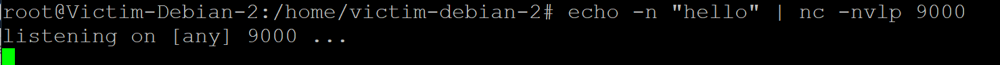

# 第五章 网络扫描：基于Scapy编写端口扫描器

## 实验要求

#### 完成以下扫描技术的编程实现
- TCP connect scan / TCP stealth scan
- TCP Xmas scan / TCP fin scan / TCP null scan
- UDP scan

#### 上述每种扫描技术的实现测试均需要测试端口状态为：开放、关闭 和 过滤 状态时的程序执行结果
#### 提供每一次扫描测试的抓包结果并分析与课本中的扫描方法原理是否相符？如果不同，试分析原因；
#### 在实验报告中详细说明实验网络环境拓扑、被测试 IP 的端口状态是如何模拟的


## 课本中扫描的原理解释
[reference](https://c4pr1c3.github.io/cuc-ns/chap0x05/main.html)

#### TCP connect scan
- 这种扫描方式可以使用 Connect()调用，使用最基本的 TCP 三次握手链接建立机制，建立一个链接到目标主机的特定端口上。
- 首先发送一个 SYN 数据包到目标主机的特定端口上，接着我们可以通过接收包的情况对端口的状态进行判断：如果接收到的是一个 SYN/ACK 数据包，则说明端口是开放状态的；如果接收到的是一个 RST/ACK 数据包，通常意味着端口是关闭的并且链接将会被重置；而如果目标主机没有任何响应则意味着目标主机的端口处于过滤状态。
- 若接收到 SYN/ACK 数据包（即检测到端口是开启的），便发送一个 ACK 确认包到目标主机，这样便完成了三次握手连接机制。成功后再终止连接。
- 不需要特殊的权限

#### TCP syn scan
- 发送一个 SYN 包启动三方握手链接机制，并等待响应
- 如果我们接收到一个 SYN/ACK 包表示目标端口是开放的；如果接收到一个 RST/ACK 包表明目标端口是关闭的；如果端口是被过滤的状态则没有响应。
- 当得到的是一个 SYN/ACK 包时通过发送一个 RST 包立即拆除连接

#### TCP Xmas scan
- Xmas 发送一个 TCP 包，并对 TCP 报文头 FIN、URG 和 PUSH 标记进行设置。若是关闭的端口则响应 RST 报文；开放或过滤状态下的端口则无任何响应。
- 需要自己构造数据包，要求拥有超级用户或者授权用户权限

#### TCP fin scan
- 仅发送 FIN 包，它可以直接通过防火墙，如果端口是关闭的就会回复一个 RST 包，如果端口是开放或过滤状态则对 FIN 包没有任何响应
- 需要自己构造数据包，要求由超级用户或者授权用户访问专门的系统调用

#### TCP null scan
- 发送一个 TCP 数据包，关闭所有 TCP 报文头标记。只有关闭的端口会发送 RST 响应
- 需要自己构造数据包，要求拥有超级用户或者授权用户权限

#### UDP scan
- 大多数 UDP 端口扫描的方法就是向各个被扫描的 UDP 端口发送零字节的 UDP 数据包
- 如果收到一个 ICMP 不可到达的回应，那么则认为这个端口是关闭的；对于没有回应的端口则认为是开放的
- 但是如果目标主机安装有防火墙或其它可以过滤数据包的软硬件,那我们发出 UDP 数据包后,将可能得不到任何回应,我们将会见到所有的被扫描端口都是开放的
- 非超级用户无法直接读取端口访问错误


## 实验环境和模拟方法
- attacker-kali 172.16.222.106/eth2
- victim-debian-2 172.16.222.147/enp0s3
- gateway-debian 172.16.222.1/enp0s10
- 在victim-debian-2上开启/过滤关闭tcp 80端口
- 在gateway-debian上模拟udp 53开启/过滤的状态(有dnsmasq服务)
- 在victim-debian-2上模拟udp 53关闭的状态(没有在使用53的服务)


## 实验过程
- 在attacker-kali上安装pycharm，方便编写python和随时测试

- `cd ~/Downloads/pycharm-community-2020.2.3/bin`进入安装目录，`sudo ./pycharm.sh`超级用户权限运行

- change python interpreter into /usr/bin/python3


- scaner.py
```
# -*-coding:utf-8 -*-
#! /usr/bin/python3

from scapy.all import *
import logging
logging.getLogger("scapy.runtime").setLevel(logging.ERROR)

def tcp_connect_scan(dst_ip):
    # gateway ip
    src_ip = "172.16.222.106"
    src_port = RandShort()
    dst_port = 80

    # respond packet
    # sc1: send packets at layer3 and return the 1st packet
    tcp_connect_scan_rp = sr1(IP(src=src_ip, dst=dst_ip)/TCP(sport=src_port,dport=dst_port))
    print(type(tcp_connect_scan_rp))

    if str(type(tcp_connect_scan_rp)) == "<class 'NoneType'>":
        print("no response, filtered.")

    # got tcp response
    elif tcp_connect_scan_rp.haslayer(TCP):
        # if is SYN-ACK
        if tcp_connect_scan_rp.getlayer(TCP).flags == 0x12:
            # sr: send and receive packets at layer3
            # ACK+RST
            send_ack = sr(IP(dst=dst_ip)/TCP(sport=src_port,dport=dst_port,flags="AR"),timeout=10)
            print("is open")
        elif tcp_connect_scan_rp.getlayer(TCP).flags == 0x14:
            print("is closed, connection will be reset.")
    print('finished tcp connect scan.\n')


# or tcp stealth scan
def tcp_syn_scan(dst_ip):
    src_port = RandShort()
    dst_port = 80

    # send SYN+port(80)
    tcp_sun_scan_p = sr1(IP(dst=dst_ip)/TCP(sport=src_port,dport=dst_port,flags="S"))
    print(type(tcp_sun_scan_p))

    if str(type(tcp_sun_scan_p)) == "<class 'NoneType'>":
        print('no response, filtered')
    elif tcp_sun_scan_p.haslayer(TCP):
        if tcp_sun_scan_p.getlayer(TCP).flags == 0x12:
            # sr: send and receive packets at layer3
            # ACK+RST
            send_ack = sr(IP(dst=dst_ip) / TCP(sport=src_port, dport=dst_port, flags="AR"), timeout=10)
            print("is open")
        elif tcp_sun_scan_p.getlayer(TCP).flags == 0x14:
            print("is closed")
    elif tcp_sun_scan_p.haslayer(ICMP):
        if int(tcp_sun_scan_p.getlayer(ICMP).type)==3 and int(tcp_sun_scan_p.getlayer(ICMP).code) in [1,2,3,9,10,13]:
            print("filtered")
    print('finished tcp syn scan.\n')


def tcp_xmas_scan(dst_ip):
    dst_port = 80
    src_port = RandShort()
    xmas_scan_resp = sr1(IP(dst=dst_ip) / TCP(dport=dst_port, flags="FPU"), timeout=10)
    print(type(xmas_scan_resp))

    if (str(type(xmas_scan_resp)) == "<class 'NoneType'>"):
        print("Open|Filtered")

    elif (xmas_scan_resp.haslayer(TCP)):
        if (xmas_scan_resp.getlayer(TCP).flags == 0x14):
            print("Closed")
    elif (xmas_scan_resp.haslayer(ICMP)):
        if (int(xmas_scan_resp.getlayer(ICMP).type) == 3 and int(xmas_scan_resp.getlayer(ICMP).code) in [1, 2, 3, 9, 10,13]):
            print("Filtered")
    print('finished tcp xmas scan.\n')


def tcp_fin_scan(dst_ip):
    src_port = RandShort()
    dst_port = 80

    fin_scan_resp = sr1(IP(dst=dst_ip) / TCP(dport=dst_port, flags="F"), timeout=10)
    print(type(fin_scan_resp))

    if (str(type(fin_scan_resp)) == "<class 'NoneType'>"):
        print("Open|Filtered")
    elif (fin_scan_resp.haslayer(TCP)):
        if (fin_scan_resp.getlayer(TCP).flags == 0x14):
            print("Closed")

    elif (fin_scan_resp.haslayer(ICMP)):
        if (int(fin_scan_resp.getlayer(ICMP).type) == 3 and int(fin_scan_resp.getlayer(ICMP).code) in [1, 2, 3, 9, 10,13]):
            print("Filtered")
    print('finished tcp fin scan.\n')


def tcp_null_scan(dst_ip):
    src_port = RandShort()
    dst_port = 80

    null_scan_resp = sr1(IP(dst=dst_ip) / TCP(dport=dst_port, flags=""), timeout=10)
    print(type(null_scan_resp))

    if (str(type(null_scan_resp)) == "<class 'NoneType'>"):
        print("Open|Filtered")

    elif (null_scan_resp.haslayer(TCP)):
        if (null_scan_resp.getlayer(TCP).flags == 0x14):
            print("Closed")
    elif (null_scan_resp.haslayer(ICMP)):
        if (int(null_scan_resp.getlayer(ICMP).type) == 3 and int(null_scan_resp.getlayer(ICMP).code) in [1, 2, 3, 9, 10,13]):
            print("Filtered")

    print('finished tcp null scan.\n')


def udp_scan(dst_ip):
    dst_port = 53
    dst_timeout = 10
    udp_scan_resp = sr1(IP(dst=dst_ip)/UDP(dport=dst_port),timeout=dst_timeout)
    print(type(udp_scan_resp))

    if (str(type(udp_scan_resp))=="<type 'NoneType'>"):
        print("open|flitered")

    elif (udp_scan_resp.haslayer(UDP)):
        print("open")

    elif(udp_scan_resp.haslayer(ICMP)): # response icmp
        # desination unreachable
        if(int(udp_scan_resp.getlayer(ICMP).type)==3 and int(udp_scan_resp.getlayer(ICMP).code) in [1,2,3,9,10,13]):
            print('closed')
    else:
        print(str(type(udp_scan_resp)))

    print('finished udp scan.\n')


if __name__ == '__main__':
    # victim_debian_2
    dst_ip = "172.16.222.147"

    print('tcp connect scan......')
    tcp_connect_scan(dst_ip)

    print('tcp syn scan.......')
    tcp_syn_scan(dst_ip)

    print('tcp xmas scan......')
    tcp_xmas_scan(dst_ip)

    print('tcp fin scan......')
    tcp_fin_scan(dst_ip)

    print('tcp null scan......')
    tcp_null_scan(dst_ip)

    print('udp scan......')
    udp_scan(dst_ip)

```


- pycharm IDE中运行scaner.py，扫描得到如下结果
```
/usr/bin/python3 /home/kali/Desktop/scans/scaner.py
tcp connect scan......
Begin emission:
.*Finished sending 1 packets.

Received 2 packets, got 1 answers, remaining 0 packets
<class 'scapy.layers.inet.IP'>
is closed, connection will be reset.
finished tcp connect scan.

tcp syn scan.......
Begin emission:
Finished sending 1 packets.
*
Received 1 packets, got 1 answers, remaining 0 packets
<class 'scapy.layers.inet.IP'>
is closed
finished tcp syn scan.

tcp xmas scan......
Begin emission:
Finished sending 1 packets.
*
Received 1 packets, got 1 answers, remaining 0 packets
<class 'scapy.layers.inet.IP'>
Closed
finished tcp xmas scan.

tcp fin scan......
Begin emission:
Finished sending 1 packets.
*
Received 1 packets, got 1 answers, remaining 0 packets
<class 'scapy.layers.inet.IP'>
Closed
finished tcp fin scan.

tcp null scan......
Begin emission:
Finished sending 1 packets.
*
Received 1 packets, got 1 answers, remaining 0 packets
<class 'scapy.layers.inet.IP'>
Closed
finished tcp null scan.

udp scan......
Begin emission:
Finished sending 1 packets.
*
Received 1 packets, got 1 answers, remaining 0 packets
<class 'scapy.layers.inet.IP'>
closed
finished udp scan.


Process finished with exit code 0

```

- 在victim-debian-2，`nc -nvlp 80`开始监听tcp 80端口


- 再次运行scaner.py，扫描得到如下结果
```
tcp connect scan......
Begin emission:
.Finished sending 1 packets.
*
Received 2 packets, got 1 answers, remaining 0 packets
<class 'scapy.layers.inet.IP'>
Begin emission:
Finished sending 1 packets.
.
Received 1 packets, got 0 answers, remaining 1 packets
is open
finished tcp connect scan.

tcp syn scan.......
Begin emission:
Finished sending 1 packets.
*
Received 1 packets, got 1 answers, remaining 0 packets
<class 'scapy.layers.inet.IP'>
Begin emission:
Finished sending 1 packets.

Received 0 packets, got 0 answers, remaining 1 packets
is open
finished tcp syn scan.

tcp xmas scan......
Begin emission:
Finished sending 1 packets.

Received 0 packets, got 0 answers, remaining 1 packets
<class 'NoneType'>
Open|Filtered
finished tcp xmas scan.

tcp fin scan......
Begin emission:
Finished sending 1 packets.

Received 0 packets, got 0 answers, remaining 1 packets
<class 'NoneType'>
Open|Filtered
finished tcp fin scan.

tcp null scan......
Begin emission:
Finished sending 1 packets.

Received 0 packets, got 0 answers, remaining 1 packets
<class 'NoneType'>
Open|Filtered
finished tcp null scan.

```
- 在victim-debian-2，`echo -n "hello" | nc -nvlp 9000`


- conduct a udp scan, result is as follows: 
```
# udp is still closed
# dst_ip = 172.16.222.147

udp scan......
Begin emission:
Finished sending 1 packets.
*
Received 1 packets, got 1 answers, remaining 0 packets
<class 'scapy.layers.inet.IP'>
closed
finished udp scan.
```

- 将udp扫描代码的端口从9000改为53，`port = 53`

- 不执行`echo -n "hello" | nc -nvlp 53`的情况下再次udp scan
```
# dst_ip = 172.16.222.1
# 由于有dnsmasq已经在使用udp 53，所以是开启的

udp scan......
Begin emission:
.Finished sending 1 packets.

Received 1 packets, got 0 answers, remaining 1 packets
<class 'NoneType'>
open|flitered
finished udp scan.
```

- victim-debian-2上找到在用udp 53的服务，并把它们关掉，并用`netstat -anp`确认没有在用udp 53的了
```
root@Victim-Debian-2:/home/victim-debian-2# netstat -anp
Active Internet connections (servers and established)
Proto Recv-Q Send-Q Local Address           Foreign Address         State       PID/Program name
tcp        0      0 0.0.0.0:22              0.0.0.0:*               LISTEN      364/sshd
tcp        0      0 192.168.56.104:22       192.168.56.1:56664      ESTABLISHED 445/sshd: victim-de
tcp        0    288 192.168.56.104:22       192.168.56.1:57250      ESTABLISHED 1251/sshd: victim-d
tcp6       0      0 :::22                   :::*                    LISTEN      364/sshd
udp        0      0 0.0.0.0:68              0.0.0.0:*                           330/dhclient
udp        0      0 0.0.0.0:68              0.0.0.0:*                           329/dhclient

```
- 不执行`echo -n "hello" | nc -nvlp 53`的情况下再次udp scan
```
# dns_ip = 172.16.222.147
udp scan......
Begin emission:
.Finished sending 1 packets.
*
Received 2 packets, got 1 answers, remaining 0 packets
<class 'scapy.layers.inet.IP'>
closed
finished udp scan.
```
注：以上抓包结果基本和课本中的原理相符


## 问题
- pycharm Errno1: permission denied，IDE运行权限不够的，改sudo运行
```
cd ~/Downlaods/pycharm/bin
sudo ./pycharm.sh
```

- 报错：NoneType object has no attribute haslayer. 输出type()，根据具体的NoneType字符串修改判定条件

- `echo -n "hello" | nc -nvlp 9000` udp端口打开失败
```
# 查看udp是否在用
systemctl status dnsmasq

#将port=9000改为port=53
```
- 有服务默认在用udp 53端口，必须把它们都关掉才算关掉53

## 参考
- [Port Scanning using Scapy](https://resources.infosecinstitute.com/port-scanning-using-scapy/)
- [自己动手编程实现并讲解TCP connect scan/TCP stealth scan/TCP XMAS scan/UDP scan](https://blog.csdn.net/jackcily/article/details/83117884)

